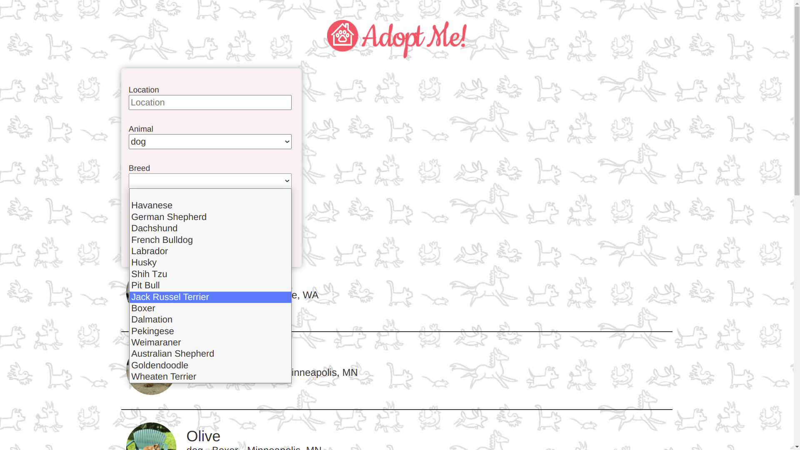
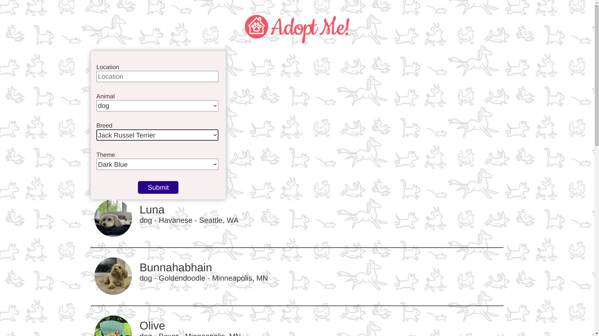
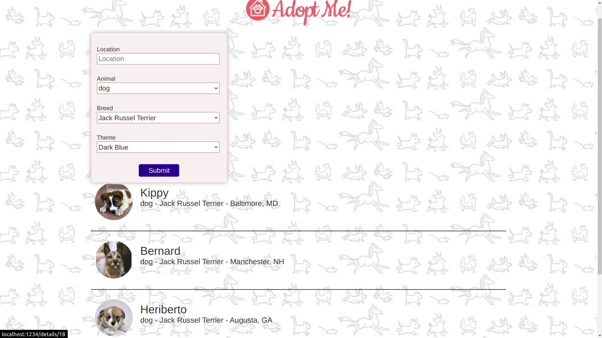
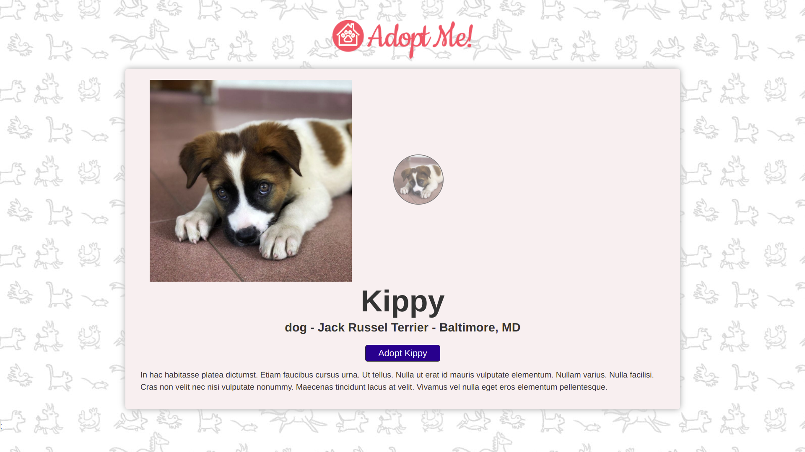
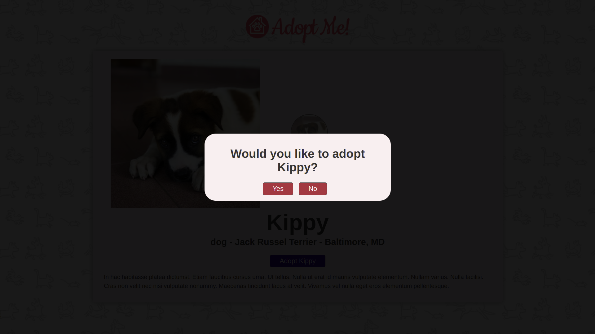

# Adopt-Me

#### A complete application to browse adoptable pets. The application is built using react.js using latest features like hooks, effects, context and using tools from the react ecosystem like Parcel, ESlint and React Router. The application is also deployed for the world to see.

- #### Select Animal, Breed and Theme of your choice and click submit

  
  

- #### The available choices of your selected options will be displayed. Select your favourite pet.

  

- #### Click on adopt me to adopt your pet
  
- #### Confirm by clicking yes or no
  
